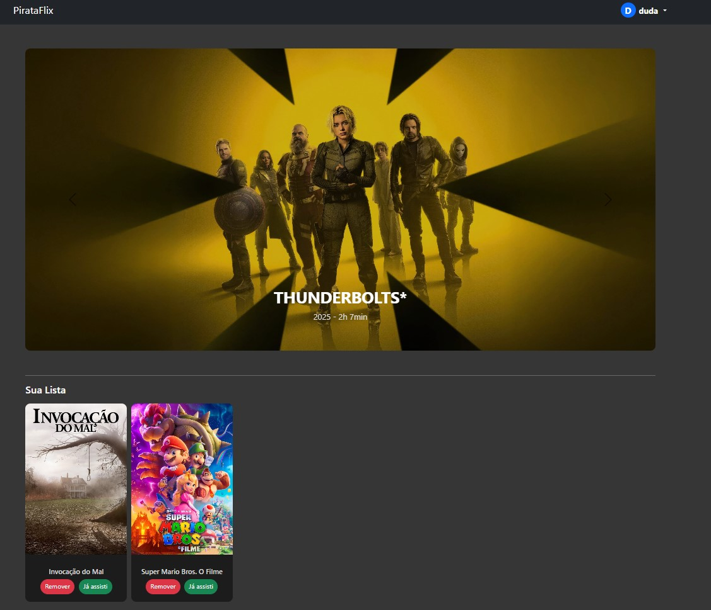
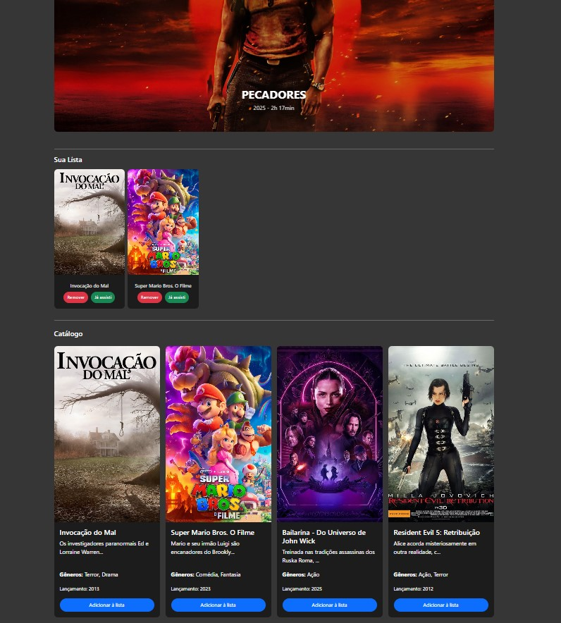
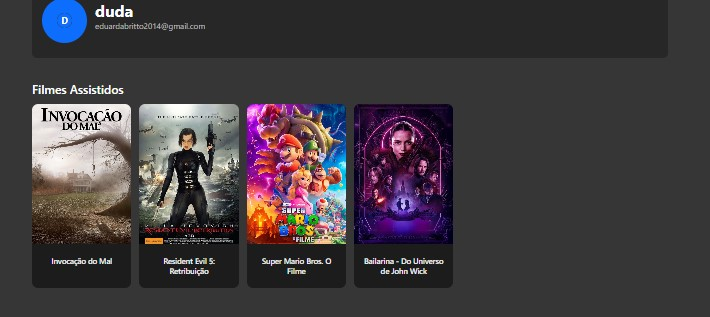
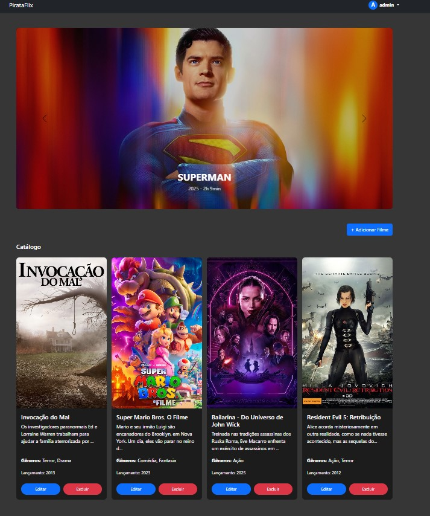

# 🎬 Catálogo de Filmes 
Aplicação web feita em **React** com integração a um backend em **Node.js/Express**. 
O sistema permite que usuários façam login/cadastro, adicionem filmes à lista de interesse, marquem como assistidos e naveguem pelo catálogo completo de filmes. 
E o administrador pode fazer CRUD completo de filmes (criar, listar, atualizar, excluir).

<div style="display: flex; gap: 10px; flex-wrap: wrap;"> 
   
   
   
   
   
   
   
   
   
</div> 

--- 

### 🚀 Funcionalidades
- Cadastro e login de usuários
- Adicionar/remover filmes da lista de interesse 
- Marcar filmes como assistidos - Visualizar catálogo de filmes
- Interface responsiva com **React Bootstrap**

### 👩‍💼 Administrador 
- CRUD completo de filmes (criar, listar, atualizar, excluir)
- Gerenciar usuários 
  
--- 

### 🛠 Tecnologias Utilizadas 
- **Frontend:** React, React Router DOM, React Bootstrap 
- **Backend:** Node.js / Express 
-**Banco de Dados:** RavenDB noSQL ou PostgreSQL 
- **Outros:** Fetch API para comunicação entre front e back

--- 

### ⚙️ Como rodar o projeto

```
# 1. Clonar o repositório
git clone https://github.com/seu-usuario/projeto-filmes.git
cd projeto-filmes

# 2. Instalar dependências
npm install

# 3. Rodar o frontend
npm start

# 4. Rodar o backend (certifique-se que está em http://localhost:5000)
npm run server
```
### Banco de Dados
Este projeto utiliza **RavenDB** (pode ser trocado por PostgreSQL).
- Instale e rode o RavenDB localmente na porta padrão (http://localhost:8080)
- Crie um banco de dados chamado filmesdb
- Configure a conexão no backend  
(.env): RAVEN_URL=http://localhost:8080  
RAVEN_DB=filmesdb

---

## 📡 Rotas principais (backend) 

### 👤 Usuários
POST /users/register → cadastro de usuário <br> 
 POST /users/login → login de usuário 

### 📡 Administrador
POST /movies → cria novo filme
PUT /movies/:id → atualiza filme existente
DELETE /movies/:id → remove filme

### 🎞 Filmes 
GET /movies → busca todos os filmes do catálogo 

### ⭐ Lista de Interesse 
GET /users/:id/listaInteresse → retorna lista de interesse do usuário <br> 
POST /users/:id/listaInteresse → adiciona filme à lista de interesse <br>
DELETE /users/:id/listaInteresse/:movieId → remove filme da lista de interesse 

### ✅ Lista de Assistidos
POST /users/:id/listaAssistido → move filme para lista de assistidos 


---
## 📸 Prints do sistema 

###  Lista de Interesse 
 

### Catálogo de Filmes 
 

###  Filmes Assistidos


### Tela do ADM

